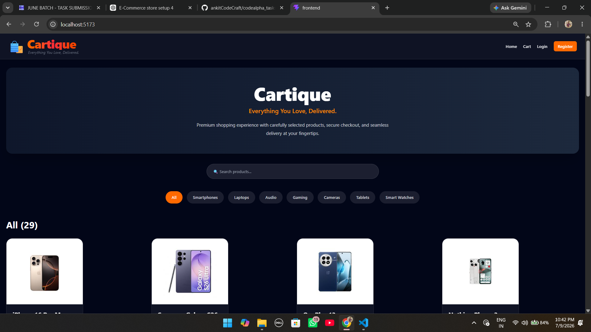
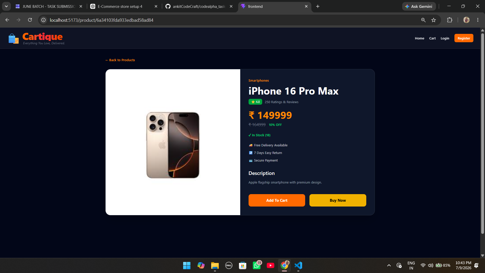
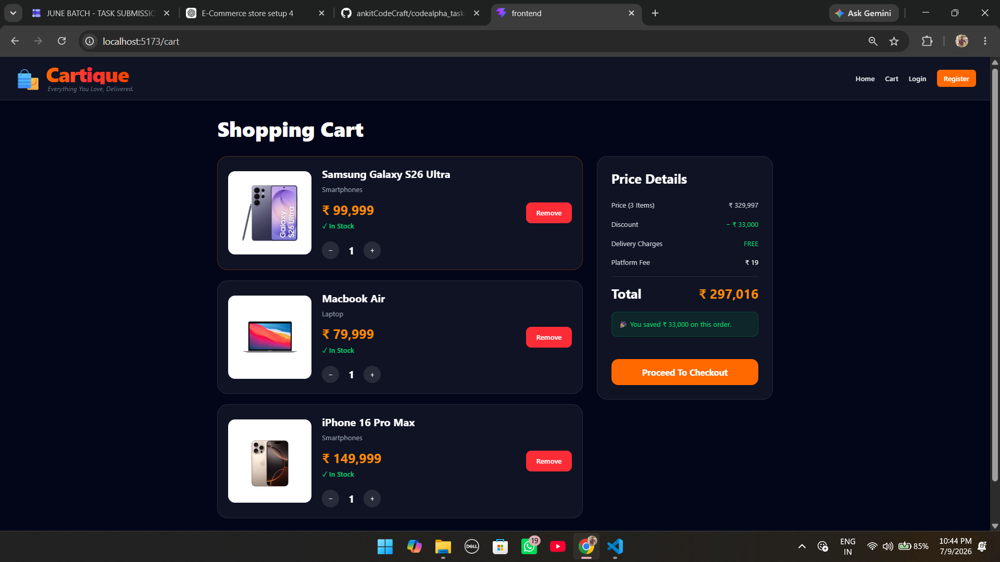
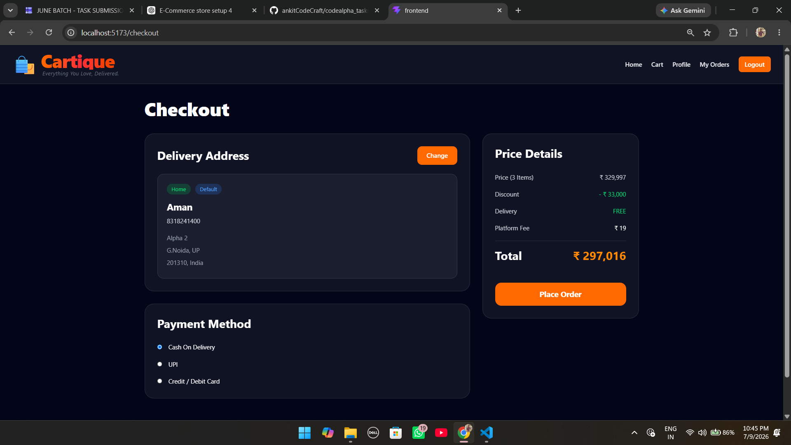
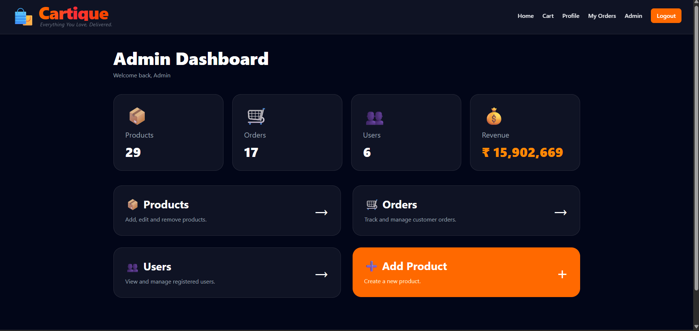
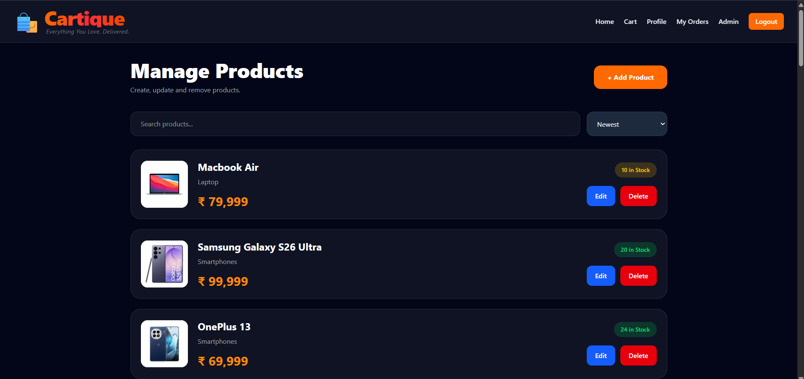
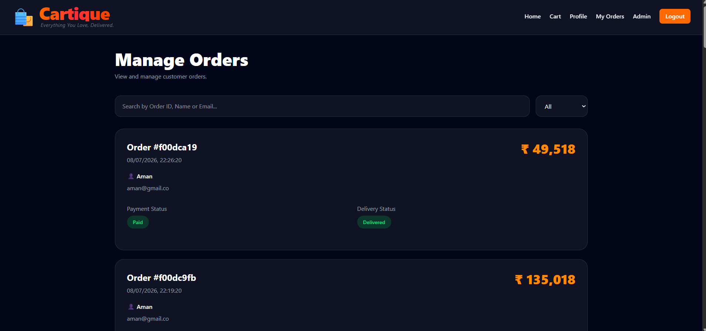
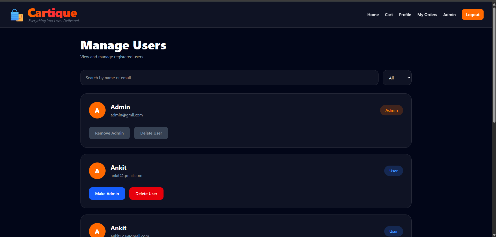

# 🛒 Cartique - MERN E-Commerce Store

<p align="center">
  <h3 align="center">Everything You Love, Delivered.</h3>
  <p align="center">
    A modern full-stack E-Commerce web application built using the MERN Stack.
  </p>
</p>

---

## 📖 About

Cartique is a full-featured E-Commerce platform developed using the **MERN Stack (MongoDB, Express.js, React, Node.js)**.

The application provides a complete shopping experience for customers while also including a powerful admin dashboard for managing products, orders, and users.

This project was developed as part of my **CodeAlpha Internship**.

---

# ✨ Features

## 👤 User Features

- User Registration & Login
- JWT Authentication
- Secure Password Encryption
- User Profile
- Address Management
- Product Search
- Category Filtering
- Product Details
- Shopping Cart
- Checkout System
- Order History
- Order Details
- Responsive UI

---

## 🛍 Product Features

- Product Listing
- Product Images
- Product Categories
- Product Description
- Stock Availability
- Price Display
- Search Suggestions

---

## 📦 Order Features

- Place Orders
- Order History
- View Order Details
- Payment Status
- Delivery Status
- Shipping Information

---

## 👨‍💼 Admin Features

- Admin Dashboard
- Product Management
- Create Product
- Edit Product
- Delete Product
- Manage Orders
- Mark Orders as Paid
- Mark Orders as Delivered
- Manage Users
- Promote User to Admin
- Remove Admin Rights
- Delete Users
- Dashboard Statistics

---

# 🛠 Tech Stack

## Frontend

- React.js
- React Router DOM
- Axios
- Tailwind CSS
- Vite

## Backend

- Node.js
- Express.js
- MongoDB
- Mongoose
- JWT Authentication
- bcryptjs

---

# 📁 Project Structure

```text
Task-1-Cartique-MERN-ECommerce
│
├── backend
│   ├── controllers
│   ├── middleware
│   ├── models
│   ├── routes
│   ├── config
│   └── server.js
│
├── frontend
│   ├── src
│   │   ├── components
│   │   ├── pages
│   │   ├── api
│   │   └── App.jsx
│   └── package.json
│
├── screenshots
│
└── README.md
```

---

# 🚀 Installation

## Clone Repository

```bash
git clone https://github.com/ankitCodeCraft/codealpha_tasks.git
```

---

## Backend Setup

```bash
cd Task-1-Cartique-MERN-ECommerce/backend
npm install
npm start
```

---

## Frontend Setup

```bash
cd Task-1-Cartique-MERN-ECommerce/frontend
npm install
npm run dev
```

---

# 🔐 Environment Variables

Create a `.env` file inside the backend folder.

```env
PORT=5000

MONGO_URI=your_mongodb_connection_string

JWT_SECRET=your_secret_key
```

---

# 📷 Screenshots

Add screenshots inside the **screenshots** folder.

Example:

```
screenshots/
│
├── home.png
├── product.png
├── cart.png
├── checkout.png
├── profile.png
├── myorders.png
├── orderdetails.png
├── admin-dashboard.png
├── admin-products.png
├── admin-orders.png
└── admin-users.png
```

Then display them like this:

## Home Page



---

## Product Page



---

## Cart



---

## Checkout



---

## Admin Dashboard



---

## Admin Products



---

## Admin Orders



---

## Admin Users



---

# 🔮 Future Improvements

- Online Payment Gateway Integration
- Wishlist
- Product Reviews & Ratings
- Coupons & Discounts
- Email Notifications
- Product Image Upload
- Sales Analytics
- Dark/Light Theme
- Multi-language Support

---

# 👨‍💻 Author

**Ankit Kumar Gupta**

B.Tech Computer Science & Engineering (AI & ML)

Noida Institute of Engineering and Technology

GitHub: https://github.com/ankitCodeCraft

---

# 📜 License

This project is developed for educational purposes as part of the **CodeAlpha Internship**.