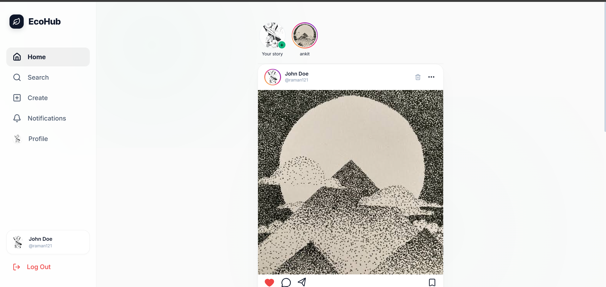
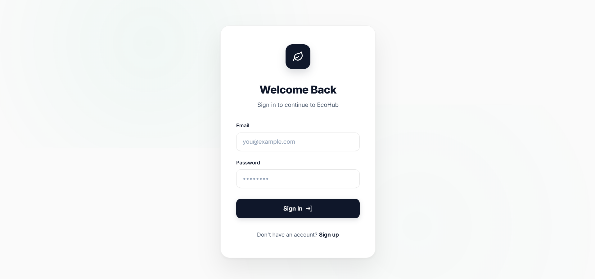
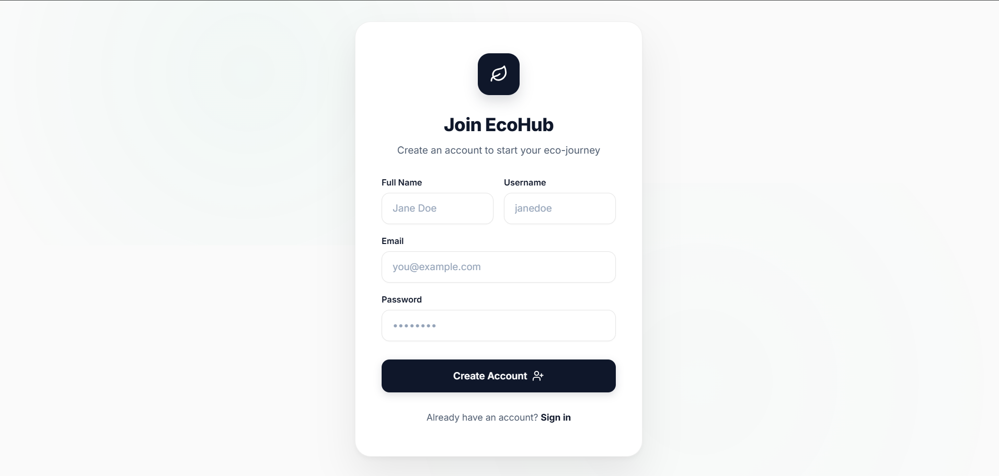
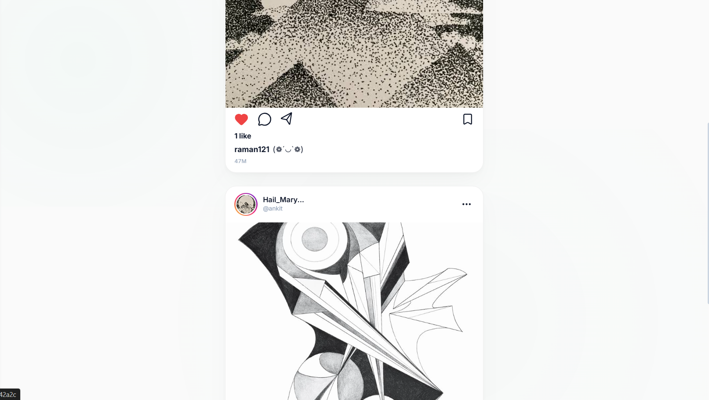
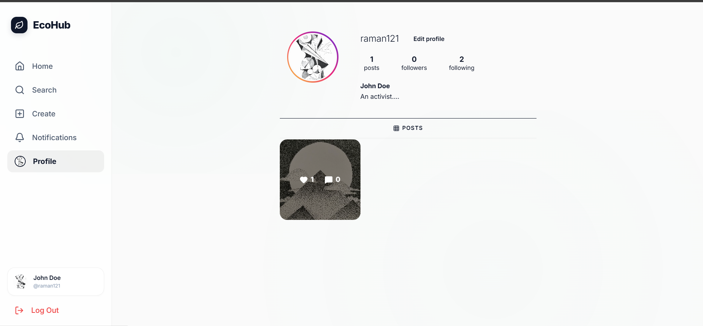
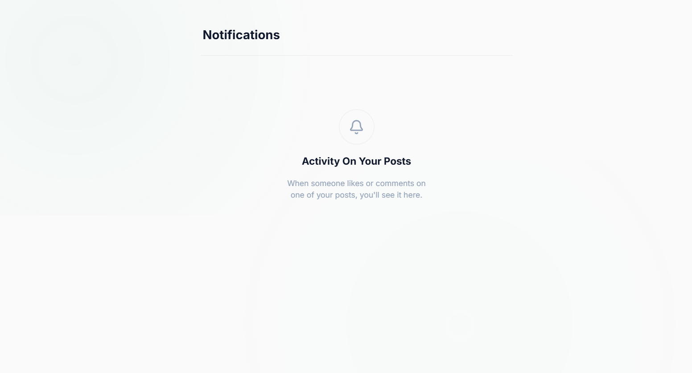
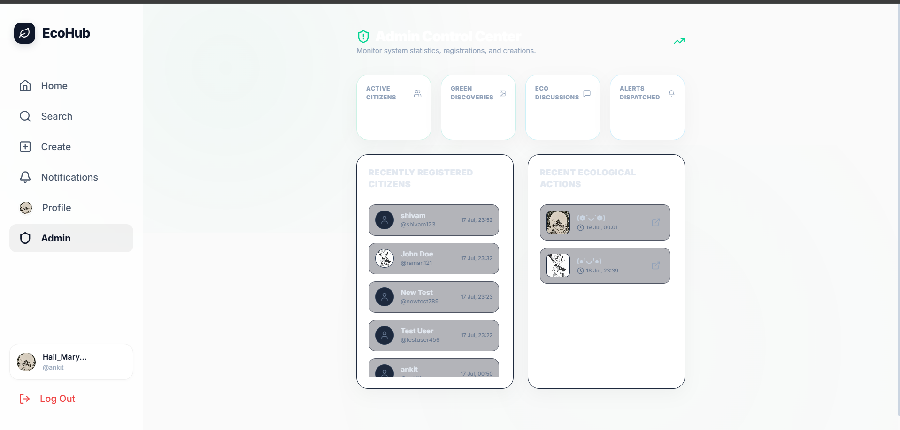

# 🌐 EcoHub - MERN Social Media Platform

<p align="center">
  <h3 align="center">Connect. Share. Inspire.</h3>
  <p align="center">
    A modern full-stack social media platform built with the MERN Stack.
  </p>
</p>

---

# 📖 About

EcoHub is a full-stack social media platform where users can connect with others by creating posts, liking and commenting, following users, and receiving notifications.

The application also includes a complete admin dashboard for managing users, posts, and platform activity.

This project was developed as part of my **CodeAlpha Internship**.

---

# ✨ Features

## 👤 User Features

- User Registration & Login
- JWT Authentication
- User Profile
- Edit Profile
- Follow / Unfollow Users
- Search Users
- Notifications
- Responsive Design

---

## 📝 Post Features

- Create Post
- Edit Post
- Delete Post
- Like / Unlike Posts
- Comment System
- Image Posts
- Feed Pagination
- Search Posts

---

## 🔔 Notification Features

- Like Notifications
- Comment Notifications
- Follow Notifications
- Notification Pagination

---

## 👨‍💼 Admin Features

- Admin Dashboard
- Manage Users
- Manage Posts
- Delete Posts
- Delete Users
- Search Users
- Statistics Dashboard

---

# 🛠 Tech Stack

## Frontend

- React
- React Router
- Axios
- Tailwind CSS
- Vite

## Backend

- Node.js
- Express.js
- MongoDB
- Mongoose
- JWT
- bcryptjs

---

# 📁 Project Structure

```text
Task-2-EcoHub-Social-Media
│
├── backend
├── frontend
├── screenshots
└── README.md
```

---

# 🚀 Installation

## Clone Repository

```bash
git clone https://github.com/ankitCodeCraft/codealpha_tasks.git
```

---

## Backend

```bash
cd Task-2-EcoHub-Social-Media/backend
npm install
npm start
```

---

## Frontend

```bash
cd Task-2-EcoHub-Social-Media/frontend
npm install
npm run dev
```

---

# 🔐 Environment Variables

Create a `.env` file inside the backend folder.

```env
PORT=5000
MONGO_URI=your_mongodb_connection_string
JWT_SECRET=your_secret_key
```

---

# 📷 Screenshots

## Home



---

## Login



---

## Register



---

## Feed



---

## Profile



---

## Notifications



---

## Admin Dashboard



---

# 🔮 Future Improvements

- Real-time Chat
- Story Feature
- Reels
- Video Upload
- Dark / Light Theme
- Email Verification
- Push Notifications

---

# 👨‍💻 Author

**Ankit Kumar Gupta**

B.Tech CSE (AI & ML)

Noida Institute of Engineering and Technology

---

# 📜 License

Developed for educational purposes as part of the **CodeAlpha Internship**.